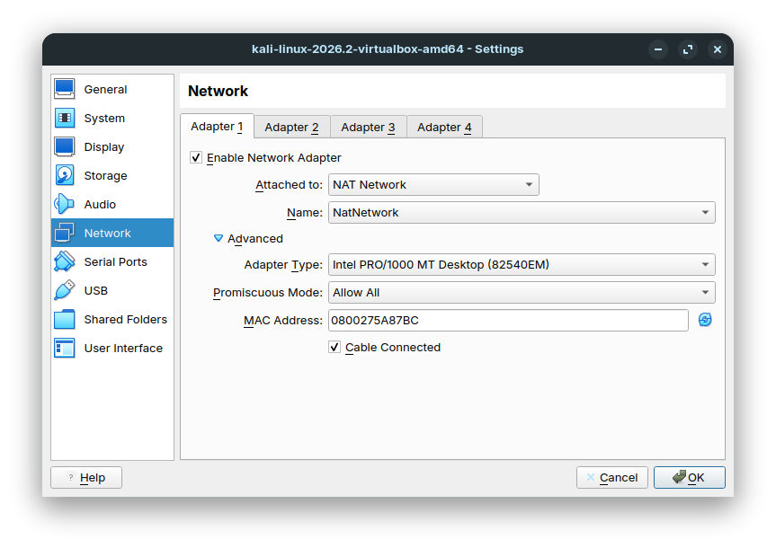
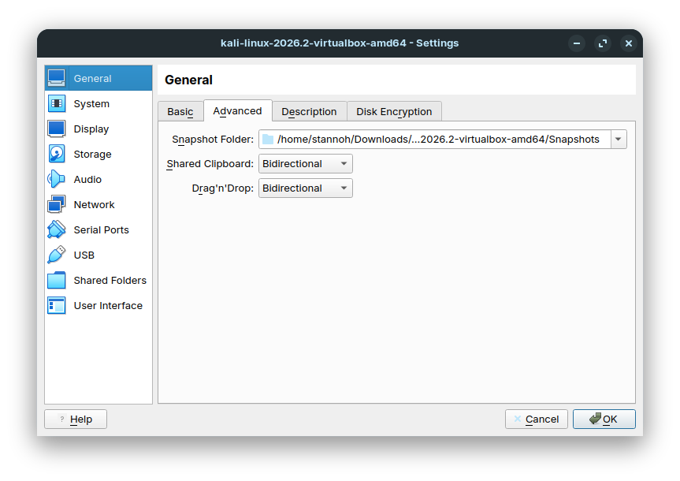
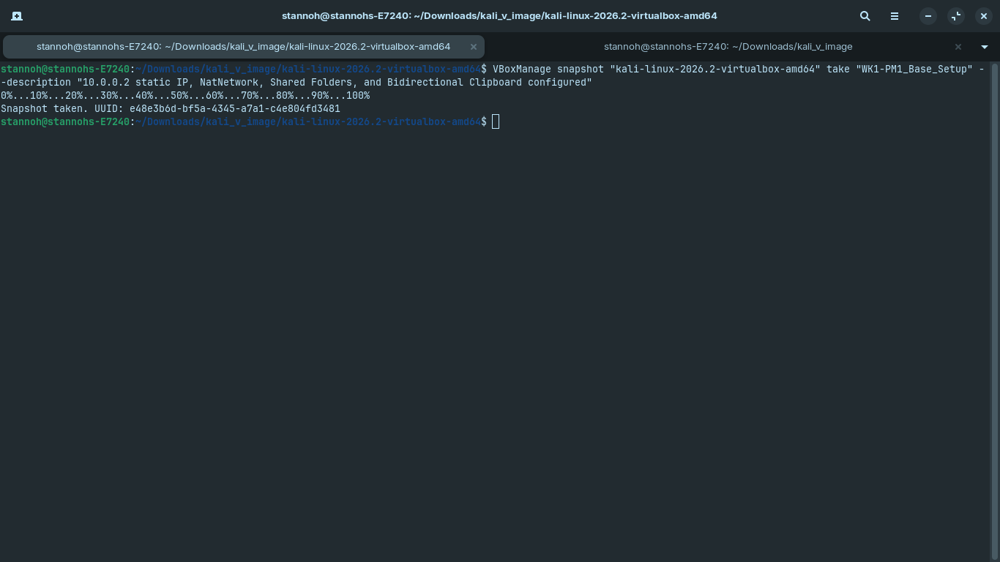
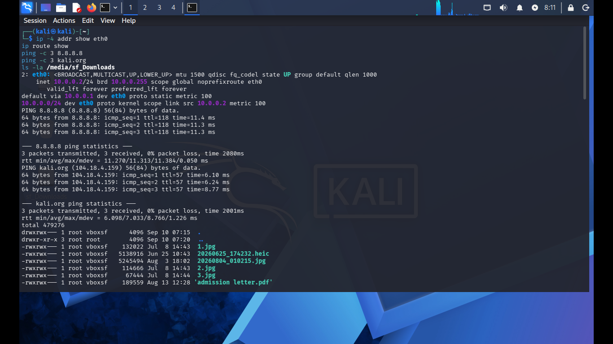

<div align="center">

# 🔐 Cybersecurity Lab Environment Setup

**Building an isolated virtual lab for penetration testing and ethical hacking practice**
</div>

<p align="center">
  
  
  
  
  
  
  
  
  
  
</p>

---

## 📌 Project Overview

This project focuses on setting up a **virtual cybersecurity and penetration-testing laboratory** using Oracle VM VirtualBox and Kali Linux.

The purpose of the lab is to create a secure, isolated, and controlled environment where cybersecurity tools, network scanning, reconnaissance, vulnerability assessment, and other security-testing activities can be performed safely and repeatedly.

The lab is configured on a dedicated private virtual NAT Network so that additional victim and target machines (e.g., Metasploitable, Windows targets) can be connected for authorized penetration testing and security exercises.

---

## 🎯 Objectives

The main objectives of this project are to:

- Install and configure VirtualBox hypervisor.
- Import and deploy Kali Linux as a security virtual machine.
- Create a private **NAT Network** (`NatNetwork` on `10.0.0.0/24`) for the cybersecurity lab.
- Configure network adapters and promiscuous mode settings.
- Enable bidirectional clipboard and drag-and-drop integration for streamlined workflow.
- Set up shared folders between the host system and the guest VM.
- Configure consistent IPv4 networking (`10.0.0.2/24`).
- Verify full network connectivity, gateway routing, DNS resolution, and shared folders.
- Take a clean baseline snapshot (`WK1-PM1_Base_Setup`) for state recovery and rollbacks.
- Document the entire setup process, configuration parameters, and verification tests.

---

## 🛡️ Purpose of the Lab

The lab provides an isolated and controlled sandbox for cybersecurity education, ethical hacking research, and authorized security assessments.

It enables practical exercises in:

- Network reconnaissance & asset discovery
- Port scanning and service enumeration
- Vulnerability assessment and vulnerability scanning
- Packet analysis and protocol inspection
- Web application security testing
- Privilege escalation and exploitation practice
- Security tool evaluation and scripting

⚠️ **Important:** This laboratory must only be used for systems that you own or have explicit authorization to test. Do not use the lab or its tools against unauthorized systems or third-party networks.

---

## ⚙️ Lab Configuration

| 🧩 Component | ⚙️ Configuration |
| :--- | :--- |
| 🖥️ **Host OS** | Ubuntu 24.04 LTS (Linux x86_64) |
| 🧠 **Host RAM** | 12 GB |
| ⚡ **Processor** | Intel Core i7-4600U |
| 🧰 **Hypervisor** | VirtualBox 7.0 |
| 🐉 **Security OS** | Kali Linux 2026.2 (64-bit) |
| 🧠 **Kali RAM** | 2048 MB |
| 🌐 **Virtual Network** | NAT Network (`NatNetwork`) |
| 📡 **Network Address** | `10.0.0.0/24` |
| 🐧 **Kali IP Address** | `10.0.0.2/24` |
| 🚪 **Default Gateway** | `10.0.0.1` |
| 🌍 **DNS Server** | `8.8.8.8` / Local Gateway |
| 🔮 **Target VM Range** | `10.0.0.3` – `10.0.0.99` |

---

# 🪜 Lab Setup Procedure

### Step 1. Hypervisor & Environment Setup
VirtualBox hypervisor was installed and configured on the host machine with virtualization extensions enabled in BIOS/UEFI.

---

### Step 2. Create the Dedicated NAT Network
A private NAT Network was created with the subnet `10.0.0.0/24` and DHCP enabled:

```text
Network Name: NatNetwork
IPv4 Prefix:  10.0.0.0/24
DHCP:         Enabled
IPv6:         Disabled
```

A **NAT Network** allows multiple VMs attached to the network to communicate directly with one another while sharing the host's internet connection via NAT.

---

### Step 3. Configure VM Network Adapter & Integration

The network adapter of the Kali Linux VM was attached to the custom NAT Network:

```text
Adapter 1: Enabled
Attached to: NAT Network
Name: NatNetwork
Adapter Type: Intel PRO/1000 MT Desktop (82540EM)
Promiscuous Mode: Allow All
Cable Connected: Yes
```



Bidirectional shared clipboard and drag-and-drop were configured in VM settings:

```text
Shared Clipboard: Bidirectional
Drag'n'Drop: Bidirectional
```



---

### Step 4. Configure Shared Folders & Guest Additions
A shared folder (`/media/sf_Downloads`) was mounted into Kali Linux with appropriate user permissions (`vboxsf` group membership) to allow seamless file transfers between host and guest.

---

### Step 5. Configure Static IP & Network Interfaces in Kali Linux
The network configuration in Kali Linux was verified with a consistent IPv4 address:

```text
Interface:   eth0
IP Address:  10.0.0.2/24
Gateway:     10.0.0.1
DNS Servers: 8.8.8.8
```

---

### Step 6. Create a Clean Baseline VM Snapshot
To guarantee a clean recovery point before starting penetration testing activities, a snapshot was generated via CLI:

```bash
VBoxManage snapshot "Kali-linux-2026.2-virtualbox-amd64" take "WK1-PM1_Base_Setup" \
  --description "10.0.0.2 static IP, NatNetwork, Shared Folders, and Bidirectional Clipboard configured"
```



---

# 🔎 Lab Verification

The setup was verified through terminal diagnostics inside the Kali Linux VM:

| ✅ Test | 🧾 Command | 🎯 Expected Result | 📊 Status |
| :--- | :--- | :--- | :--- |
| 🌐 **Check IP Address** | `ip -4 addr show eth0` | IP `10.0.0.2/24` assigned | **PASS** |
| 🚪 **Default Gateway** | `ip route show` | `default via 10.0.0.1 dev eth0` | **PASS** |
| 🌍 **Internet Connectivity** | `ping -c 3 8.8.8.8` | 0% packet loss, active ICMP replies | **PASS** |
| 🔎 **DNS Resolution** | `ping -c 3 kali.org` | Resolves domain (`104.18.4.159`), 0% packet loss | **PASS** |
| 📁 **Shared Folder Access** | `ls -la /media/sf_Downloads` | Accessible files listed with `vboxsf` | **PASS** |

### Verification Evidence:



```text
kali@kali:~$ ip -4 addr show eth0
2: eth0: <BROADCAST,MULTICAST,UP,LOWER_UP> mtu 1500 qdisc fq_codel state UP group default qlen 1000
    inet 10.0.0.2/24 brd 10.0.0.255 scope global noprefixroute eth0
       valid_lft forever preferred_lft forever

kali@kali:~$ ip route show
default via 10.0.0.1 dev eth0 proto static metric 100 
10.0.0.0/24 dev eth0 proto kernel scope link src 10.0.0.2 metric 100 

kali@kali:~$ ping -c 3 8.8.8.8
PING 8.8.8.8 (8.8.8.8) 56(84) bytes of data.
64 bytes from 8.8.8.8: icmp_seq=1 ttl=118 time=11.4 ms
64 bytes from 8.8.8.8: icmp_seq=2 ttl=118 time=11.3 ms
64 bytes from 8.8.8.8: icmp_seq=3 ttl=118 time=11.3 ms

--- 8.8.8.8 ping statistics ---
3 packets transmitted, 3 received, 0% packet loss, time 2080ms
rtt min/avg/max/mdev = 11.270/11.313/11.384/0.050 ms

kali@kali:~$ ping -c 3 kali.org
PING kali.org (104.18.4.159) 56(84) bytes of data.
64 bytes from 104.18.4.159: icmp_seq=1 ttl=57 time=6.10 ms
64 bytes from 104.18.4.159: icmp_seq=2 ttl=57 time=6.24 ms
64 bytes from 104.18.4.159: icmp_seq=3 ttl=57 time=8.77 ms

--- kali.org ping statistics ---
3 packets transmitted, 3 received, 0% packet loss, time 2001ms
rtt min/avg/max/mdev = 6.098/7.033/8.766/1.226 ms
```

---

# 🐞 Problems Encountered & Solutions

### Problem 1: Shared Folder Permission Restrictions
- **Issue:** The guest OS mounted `/media/sf_Downloads` with root ownership and `vboxsf` group permissions, preventing the regular user account from writing or reading files without sudo.
- **Solution:** Added the current user to the `vboxsf` supplementary group using:
  ```bash
  sudo usermod -aG vboxsf $USER
  ```
  Logged out and logged back in to apply group permissions.

### Problem 2: Network Interface Initialization & IP Conflict Prevention
- **Issue:** VirtualBox NAT Network DHCP may lease transient addresses if static IP assignments aren't explicitly mapped in NetworkManager.
- **Solution:** Configured connection profile with explicit IPv4 gateway (`10.0.0.1`), subnet mask (`/24`), and designated static IP (`10.0.0.2`), preventing DHCP lease renewal conflicts.

---

# 💡 Key Takeaways & Lessons Learned

1. **NAT vs. NAT Network:** Standard NAT isolates each VM into its own standalone private translation space. NAT Network creates an internal virtual broadcast domain where multiple VMs can see and attack/defend against each other while still reaching the internet.
2. **Snapshot Management:** Establishing an immutable baseline snapshot (`WK1-PM1_Base_Setup`) immediately after initial configuration protects against system corruption during exploits and kernel-level testing.
3. **VM Hardening & Integration:** Proper setup of Guest Additions, bidirectional clipboard, and shared folders maximizes testing efficiency without exposing host system credentials.

---

# 🔐 Security & Ethical Use

This laboratory is created strictly for academic, research, and authorized educational purposes. All techniques and tools executed within this environment are confined to the isolated virtual subnet.

---

# 🔗 Tools & Resources

- **VirtualBox:** [https://virtualbox.org/wiki/Downloads](https://virtualbox.org/wiki/Downloads)
- **Kali Linux:** [https://kali.org/get-kali](https://kali.org/get-kali)
- **Wireshark:** [https://www.wireshark.org/](https://www.wireshark.org/)
- **Nmap Network Scanner:** [https://nmap.org/](https://nmap.org/)

---

## 📌 Project Information

**Program:** Cybersecurity Networkwalks | **Week:** 01 | **Milestone:** WK1-PM1 - Cybersecurity Lab Setup | **Platform:** GitHub
